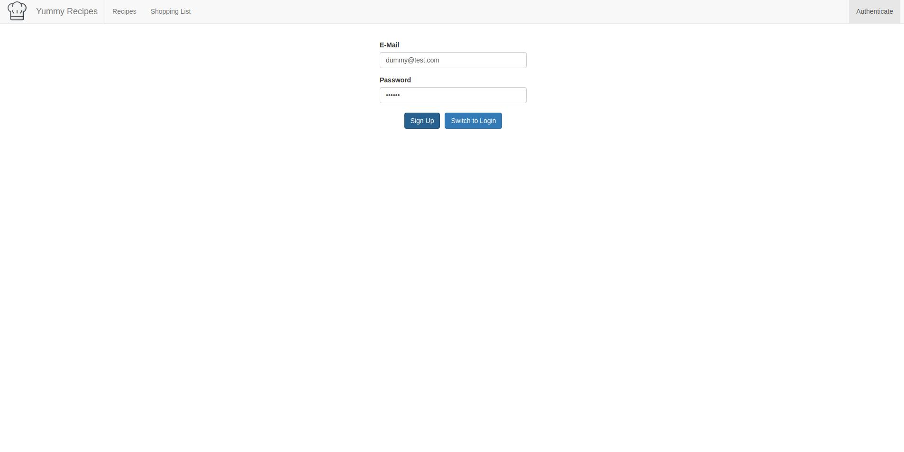
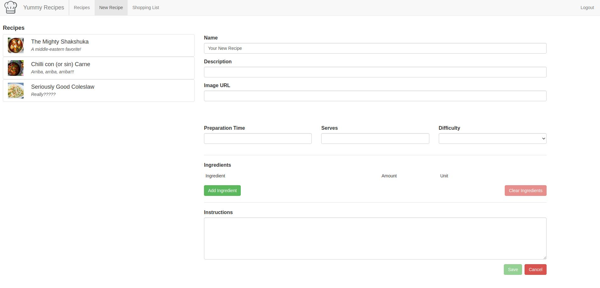
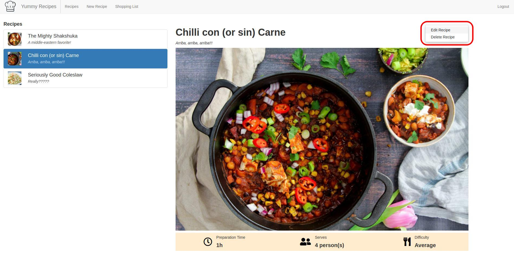
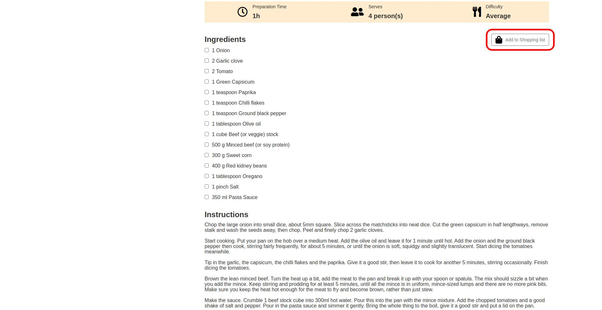
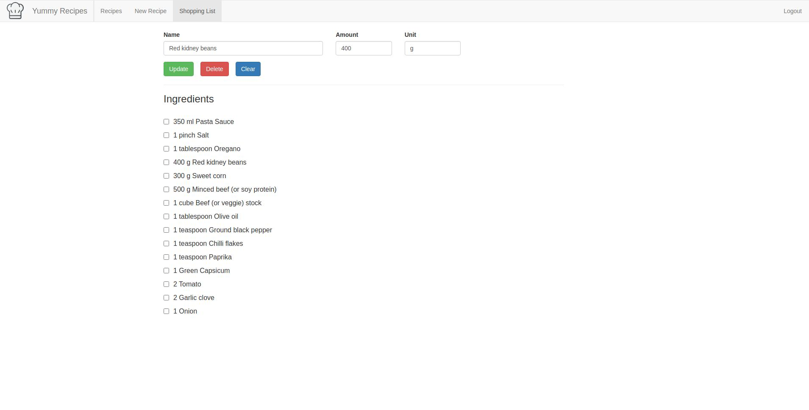

<!-- PROJECT SHIELDS -->
<!--
*** I'm using markdown "reference style" links for readability.
*** Reference links are enclosed in brackets [ ] instead of parentheses ( ).
*** See the bottom of this document for the declaration of the reference variables
*** for contributors-url, forks-url, etc. This is an optional, concise syntax you may use.
*** https://www.markdownguide.org/basic-syntax/#reference-style-links
-->

[![Contributors][contributors-shield]][contributors-url]
[![Forks][forks-shield]][forks-url]
[![Stargazers][stars-shield]][stars-url]
[![Issues][issues-shield]][issues-url]
[![LinkedIn][linkedin-shield]][linkedin-url]

<!-- PROJECT LOGO -->
<br />
<p align="center">
  <a href="https://github.com/sgtbrunner/yummy-recipes">
    
  </a>

  <h3 align="center">Yummy Recipes</h3>

  <p align="center">
    The ultimate recipe app is finally here!
    <br />
    <a href="https://github.com/sgtbrunner/yummy-recipes"><strong>Explore the docs »</strong></a>
    <br />
    <br />
    <a href="https://sgtbrunner.github.io/yummy-recipes/">View Demo</a>
    ·
    <a href="https://github.com/sgtbrunner/yummy-recipes/issues">Report Bug / Request Feature</a>
  </p>
</p>

<!-- TABLE OF CONTENTS -->
<details open="open">
  <summary>Table of Contents</summary>
  <ol>
    <li>
      <a href="#about-the-project">About The Project</a>
      <ul>
        <li><a href="#built-with">Built With</a></li>
      </ul>
    </li>
    <li>
      <a href="#getting-started">Getting Started</a>
      <ul>
        <li><a href="#prerequisites">Prerequisites</a></li>
        <li><a href="#installation">Installation</a></li>
      </ul>
    </li>
    <li><a href="#usage">Usage</a></li>
    <li><a href="#roadmap">Roadmap</a></li>
    <li><a href="#contributing">Contributing</a></li>
    <li><a href="#contact">Contact</a></li>
    <li><a href="#acknowledgements">Acknowledgements</a></li>
  </ol>
</details>

<!-- ABOUT THE PROJECT -->
## About The Project

[![Yummy Recipes][product-screenshot]](https://sgtbrunner.github.io/yummy-recipes/)

The ultimate recipe app is finally here! Yummy Recipes can help you out with either your favourite recipes or your loved shopping list.

This project was originally built as a pratical exercise to learning Angular 2+, Typescript, Bootstrap and Firebase Realtime Database API integration.

### Built With

  Yummy Recipes was built with the following technologies:

  <div>
    
    
    
    
    
    
        
  </div>
  <br />

<!-- GETTING STARTED -->
## Getting Started

To get a local copy up and running follow these simple example steps.

### Prerequisites

Have `npm` installed in your machine.  
* npm
  ```sh
  npm install npm@latest -g
  ```

Have a Firebase Realtime Database set up and running. Click [here](https://firebase.google.com/) to create it if you don't have one already.

### Installation
  On terminal

1. Clone the repo
   ```sh
   git clone https://github.com/sgtbrunner/yummy-recipes
   ```
2. Navigate to project folder
   ```sh
   cd yummy-recipes
   ```  
3. Install NPM packages
   ```sh
   npm install
   ```

4. Replace `DATABASE_URL` and `RECIPES_TABLE` constants in the `src/app/shared/constants/app-constants.ts` file with your own Database URL and Recipe Table file name respectively

5. Create files `environment.ts` and `environment.prod.ts` in `src/environments` folder. In both files, place the following code:
   ```
   export const environment = {
      production: ( false if environment.ts and true if file is environment.prod.ts),
      API_KEY: '',
      MASTER_USER_ID: ''
   };
   ```

6. Fill in `API_KEY` and `MASTER_USER_ID` with your own API KEY (from your Firebase Realtime Database) and ADMIN USER ID (the user you have setup on Firebase as the main user) respectively.

    PS: The ADMIN USER is the user whose added recipes will show up as the default recipes every time the app is loaded.

<!-- USAGE EXAMPLES -->
## Usage
  Run the following commands on terminal within the project folder

1. Starting the app
   ```sh
   npm start
   ```
   If you browser doesn't open automatically, open it and navigate to
   ```sh
   http://localhost:4200/
   ```

    You can create an account to get access to your customized space...

    

    ...add customized recipes...
    

    ... edit or delete existing ones...
    

    ... send your recipes to a shopping list...
    

    ... and view/edit your shopping list before heading to the shop!
    

2. Linting the app
   ```sh
   npm run lint
   ```

3. Building the app
   ```sh
   npm run build
   ```

<!-- ROADMAP -->
## Roadmap
See the [open issues](https://github.com/sgtbrunner/yummy-recipes/issues) for a list of proposed features (and known issues).

<!-- CONTRIBUTING -->
## Contributing

Contributions are what make the open source community such an amazing place to be learn, inspire, and create. Any contributions you make are **greatly appreciated**.

1. Fork the Project
2. Create your Feature Branch (`git checkout -b feature/AmazingFeature`)
3. Commit your Changes (`git commit -m 'Add some AmazingFeature'`)
4. Push to the Branch (`git push origin feature/AmazingFeature`)
5. Open a Pull Request


<!-- CONTACT -->
## Contact

Guilherme Brunner - guilherme.brunner@gmail.com

Project Link: [https://github.com/sgtbrunner/yummy-recipes](https://github.com/sgtbrunner/yummy-recipes)


<!-- ACKNOWLEDGEMENTS -->
## Acknowledgements
* [Font Awesome](https://fontawesome.com/)
* [Eslint](https://eslint.org/)
* [Prettier](https://prettier.io/)
* [GitHub Pages](https://pages.github.com)

<!-- MARKDOWN LINKS & IMAGES -->
<!-- https://www.markdownguide.org/basic-syntax/#reference-style-links -->
[contributors-shield]: https://img.shields.io/github/contributors/sgtbrunner/yummy-recipes.svg?style=for-the-badge
[contributors-url]: https://github.com/sgtbrunner/yummy-recipes/graphs/contributors
[forks-shield]: https://img.shields.io/github/forks/sgtbrunner/yummy-recipest.svg?style=for-the-badge
[forks-url]: https://github.com/sgtbrunner/yummy-recipes/network/members
[stars-shield]: https://img.shields.io/github/stars/sgtbrunner/yummy-recipes.svg?style=for-the-badge
[stars-url]: https://github.com/sgtbrunner/yummy-recipes/stargazers
[issues-shield]: https://img.shields.io/github/issues/sgtbrunner/yummy-recipes.svg?style=for-the-badge
[issues-url]: https://github.com/sgtbrunner/yummy-recipes/issues
[linkedin-shield]: https://img.shields.io/badge/-LinkedIn-black.svg?style=for-the-badge&logo=linkedin&colorB=555
[linkedin-url]: https://linkedin.com/in/guilherme-brunner
[product-screenshot]: src/assets/img/screenshot.jpg